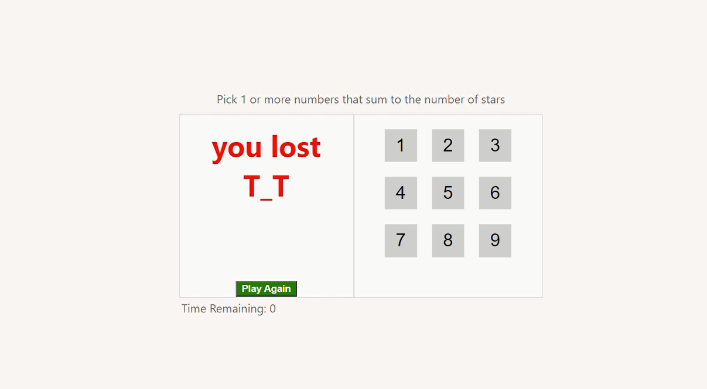

# star matching Game

choose number or collection of numbers that match the number of stars on the screen in 15 seconds

## [live site](https://ahmedeid1.github.io/react_StarMatch/)

---

## screens from the game

- 
- 
- 
- 
- 

## running the game
### `npm start`

Runs the app in the development mode. 
Open [http://localhost:3000](http://localhost:3000) to view it in the browser.

The page will reload if you make edits. 
You will also see any lint errors in the console.

